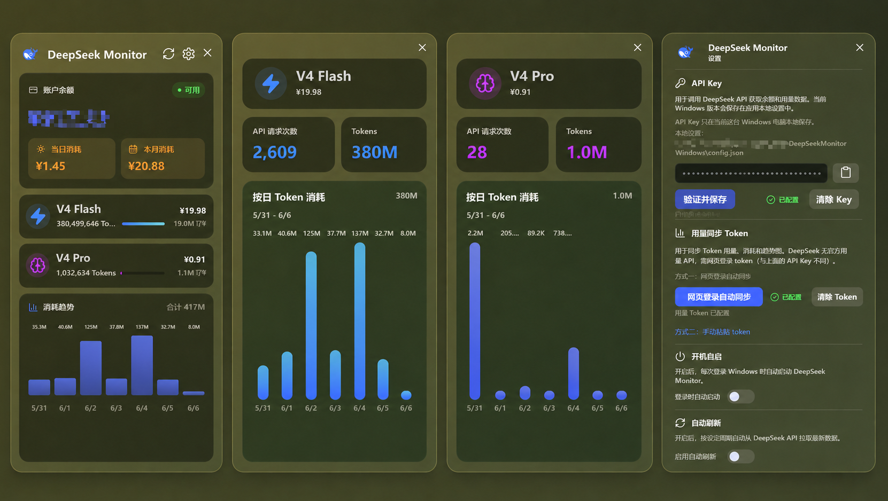

# DeepSeek Monitor Windows (Enhanced Fork)

基于 [Joyi-code/DeepSeekMonitorWindows](https://github.com/Joyi-code/DeepSeekMonitorWindows) 的增强版本，Windows 桌面端 DeepSeek API 用量监控工具。

## 增强功能

### v1.2.0
- **动态模型支持**：自动展示所有返回的模型，新模型自动配色
- **托盘悬停提示**：鼠标悬停查看余额、今日消耗与本月消费
- **提醒与预算**：余额提醒阈值和月度预算，触发系统通知
- **余额可用天数预测**：按近 7 日日均消耗估算
- **当日消耗环比**：显示与昨日相比的涨跌百分比
- **历史月份查看**：详情页可切换任意月份，支持近 7 天/全月视图
- **CSV 导出**：一键导出当月逐日逐模型用量明细
- **窗口置顶**、Esc 隐藏窗口、失焦自动隐藏
- **主题三态**：深色/浅色/跟随系统
- **安全加固**：API Key 与 Token 改用 Windows DPAPI 加密存储

## 截图



## 安装

下载 Release 中的 `DeepSeekMonitorWindows_1.3.0_x64-setup.exe` 安装即可。

## 源码构建

```powershell
git clone https://github.com/lungphage/DeepSeekMonitorWindows.git
cd DeepSeekMonitorWindows
npm install
npm run tauri:dev
```

## 系统要求

- Windows 10/11
- Microsoft Edge WebView2 Runtime (Win11 已内置)

## 许可证

MIT License - 详见 [LICENSE](LICENSE)

## 致谢

- 原项目：[JayHome137/deepseek-monitor](https://github.com/JayHome137/DeepSeekMonitor)
- 上游 Fork：[Joyi-code/DeepSeekMonitorWindows](https://github.com/Joyi-code/DeepSeekMonitorWindows)